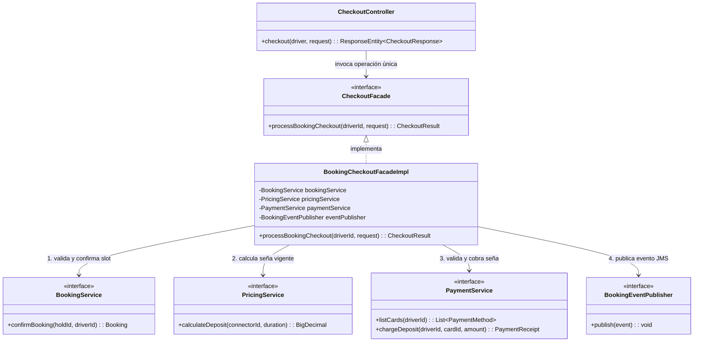
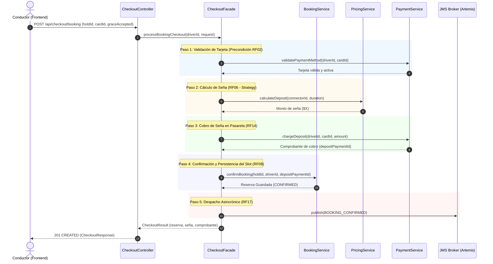

# Documentación de Patrón de Diseño: Facade (Fachada) en el Checkout de EcoPedia

**Materia:** Desarrollo de Aplicaciones II (3.4.218) — UADE  
**Equipo:** Grupo 12  
**Tarea Jira:** [ECO-35] Aplicar y documentar el patrón Facade para el checkout  
**Responsable:** Santiago Andrés Ferreyra  
**Entrega:** Entrega Parcial N.º 3  

---

## 1. Identificación del Patrón

* **Patrón:** Facade (Fachada)
* **Clasificación:** Patrón Estructural (Gang of Four - GoF)
* **Componente / Módulo:** `ecopedia-charging` (Subsistema de Checkout y Reservas)
* **Objetivo principal:** Proveer una interfaz unificada y de alto nivel que simplifique la interacción con un conjunto heterogéneo y complejo de subsistemas (Reservas, Tarificación, Pagos y Notificaciones Asincrónicas), ocultando los detalles de su orquestación y preservando la arquitectura en capas.

---

## 2. Contexto y Problema en EcoPedia

En el modelo de negocio de EcoPedia, el proceso de **Checkout de una Reserva / Carga** no es una operación atómica ni autocontenida dentro de un solo dominio. Para que un conductor confirme una reserva de carga con seña (según los requerimientos funcionales **RF06, RF08, RF09 y RF14**), el sistema debe coordinar múltiples componentes que residen en distintos artefactos:

1. **Componente de Reservas (`BookingService` en `ecopedia-charging`):**
   * Valida la vigencia de la retención temporal (`Hold`) del slot.
   * Verifica la ausencia de solapamientos con otras reservas confirmadas.
   * Persiste la reserva en estado `CONFIRMED` y libera la retención en memoria.
2. **Componente de Tarificación (`PricingService` en `ecopedia-core`):**
   * Determina el esquema tarifario activo para el conector solicitado.
   * Calcula el importe estimado de la carga y el monto exacto de la seña/depósito exigido (RF06: el estimado nunca puede ser inferior a la seña).
3. **Componente de Pagos (`PaymentService` en `ecopedia-integration`):**
   * Valida que el conductor cuente con una tarjeta de crédito/débito activa y cobrable (precondición RF02).
   * Procesa la retención o cobro de la seña a través de la pasarela de pagos.
4. **Componente de Mensajería Asincrónica (`BookingEventPublisher` hacia ActiveMQ Artemis):**
   * Despacha el evento `BOOKING_CONFIRMED` a la cola JMS `notifications.dispatch` para que el worker asincrónico registre el historial y emita el comprobante por correo electrónico (RF17).

### El Problema Arquitectónico:
Si no se utiliza un patrón estructural como **Facade**:
* **Enfoque Naive 1 (Orquestación en la UI/Frontend):** El cliente React/Vite tendría que realizar 4 peticiones HTTP secuenciales coordinadas desde el navegador. Cualquier fallo de red o cierre de pestaña en el paso 3 o 4 dejaría el sistema en un estado inconsistente (ej. seña cobrada en pasarela sin reserva confirmada en la base).
* **Enfoque Naive 2 (Orquestación en el Controlador REST):** El controlador de presentación (`BookingController`) acumularía lógica de negocio, manejo de transacciones complejas, compensaciones y dependencias hacia múltiples servicios, violando el principio de **Arquitectura en Capas** exigido por la cátedra.
* **Enfoque Naive 3 (Sobrecarga de `BookingService`):** Acoplar `PaymentService` y `PricingService` dentro de `BookingServiceImpl` violaría el principio de **Responsabilidad Única (SRP)**, transformando al servicio de reservas en un "God Object" que sabe de pasarelas de pago y fórmulas tarifarias.

---

## 3. Solución Aplicada: Patrón Facade

Se introduce el componente **`CheckoutFacade`** (con su interfaz e implementación `BookingCheckoutFacadeImpl`) dentro del dominio de carga/reservas. 

El Facade expone **una única operación pública de alto nivel**:

```java
CheckoutResult processBookingCheckout(Long driverId, CheckoutBookingRequest request);
```

Toda la complejidad de coordinación entre los cuatro subsistemas queda encapsulada detrás de esta interfaz.

### Diagrama de Clases del Patrón



---

## 4. Diagrama de Secuencia: Flujo de Checkout Orquestado



---

## 5. Justificación del Patrón y Alternativas Descartadas

La consigna de la materia exige que cada patrón seleccionado se justifique detallando el problema concreto en el dominio y las alternativas descartadas:

| Alternativa | Descripción | Por qué fue descartada |
| :--- | :--- | :--- |
| **Alternativa 1: Orquestación en el Frontend** | El navegador invoca sucesivamente `/holds`, `/pricing/estimate`, `/payment-methods/charge` y `/bookings/confirm`. | **Inadmisible por consistencia y latencia:** Expone la topología interna del backend, multiplica el tráfico de red en conexiones móviles de los conductores y carece de transaccionalidad. Si se corta la conexión tras cobrar la seña, el conductor paga pero la reserva nunca se genera. |
| **Alternativa 2: Orquestación en el Controller Web** | El `@RestController` inyecta los 4 servicios y ejecuta la secuencia antes de retornar la respuesta HTTP. | **Violación de Arquitectura en Capas:** La capa web solo debe encargarse de deserialización, validación sintáctica de DTOs, códigos de estado HTTP y autorización de roles (`@PreAuthorize`). Meter lógica de coordinación allí impide reutilizar el checkout desde otros canales (ej. mensajería, consola o procesos batch). |
| **Alternativa 3: Acoplamiento en `BookingServiceImpl`** | Se inyectan `PaymentService` y `PricingService` directamente dentro de `BookingServiceImpl`. | **Violación de Principio de Responsabilidad Única (SRP):** El componente de Reservas es un componente de gestión de estado conversacional de horarios y concurrencia. No debe asumir dependencias rígidas hacia pasarelas externas de dinero ni reglas de tarificación. |
| **Alternativa Seleccionada: Patrón Facade** | Se introduce una clase de fachada `BookingCheckoutFacadeImpl` que actúa como punto de entrada de negocio para el caso de uso del checkout. | **Solución Óptima:** Cumple con la arquitectura en capas, aísla la complejidad, ofrece una sola operación atómica y coherente a la presentación, y permite coordinar mecanismos de compensación ante fallos externos. |

---

## 6. Resiliencia y Mecanismo de Compensación (Defensa Oral)

Un aspecto central de la evaluación es el manejo de fallos parciales durante el flujo del Facade:

1. **Fallo en Validación o Cálculo Tarifario:** Ocurre antes de interactuar con la pasarela de pagos. No hay movimiento de dinero ni reservas comprometidas; el Facade cancela el flujo y devuelve un error descriptivo (400 Bad Request).
2. **Fallo en la Pasarela de Pagos (Tarjeta rechazada / timeout):** El cobro de la seña no prospera. El Facade aborta la confirmación; el `Hold` del slot permanece intacto para que el conductor pueda seleccionar otro medio de pago dentro del tiempo de vigencia.
3. **Fallo en la Persistencia de la Reserva tras cobro exitoso:** Si la base de datos local rechaza la persistencia de la reserva habiéndose ya cobrado la seña en la pasarela, el Facade dispara inmediatamente la **llamada de compensación** (`paymentService.refund(...)`) y/o encola el evento de reintegro en el broker para garantizar que no exista cobro indebido sin reserva efectiva.

---

## 7. Mapeo con los Criterios de Evaluación del TPO

* **Patrones exigidos por la consigna (Mínimo 3):**
  1. **DAO (Data Access Object):** Aplicado en todos los componentes para desacoplar las entidades de dominio de la persistencia relacional con Spring Data JPA.
  2. **Strategy:** Aplicado en `PricingService` para el cálculo dinámico de tarifas (tarifa plana, hora pico/valle, penalización por permanencia).
  3. **Facade:** Aplicado en el Checkout (`ecopedia-charging`) para orquestar reservas, tarificación, pagos y mensajería en una sola operación de alto nivel.
  4. **Adapter:** Aplicado en `PaymentService` para uniformar la comunicación hacia la pasarela de pagos externa.
* **Seguridad Declarativa:** La operación de checkout expuesta por el controlador está protegida con `@PreAuthorize("hasRole('CONDUCTOR')")` asegurando que solo el titular autenticado pueda comprometer sus medios de pago y confirmar slots.
